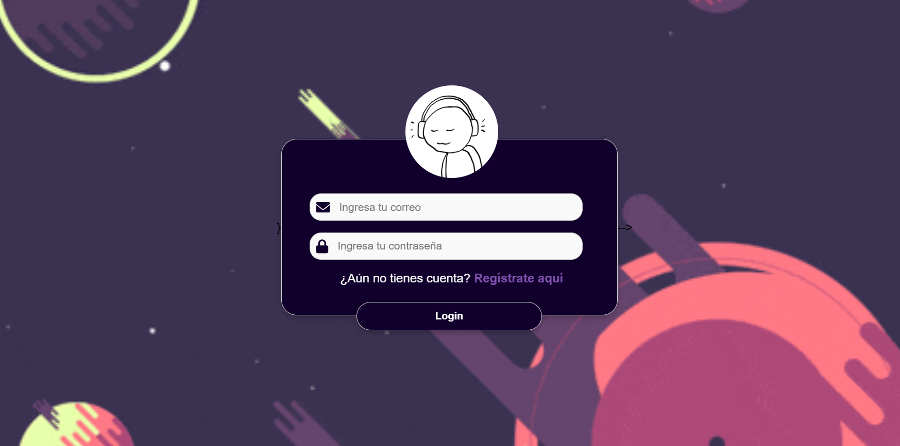
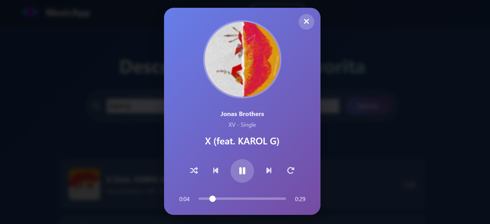

# 🎵 Reproductor de Música

<div align="center">


</div>

## 📝 Descripción

Reproductor es una aplicación web moderna desarrollada con Node.js y Express que permite a los usuarios gestionar y reproducir su música favorita. La aplicación implementa un sistema de autenticación seguro y una interfaz de usuario intuitiva para una experiencia musical óptima.

## ✨ Características

- 🔐 Sistema de autenticación seguro
- 🎧 Reproducción de música en streaming
- 📱 Interfaz de usuario responsive
- 🔄 Gestión de playlists
- 🔍 Búsqueda de canciones
- 👤 Perfiles de usuario personalizables

## 📸 Capturas de Pantalla

<div align="center">
  <h3>Interfaz Principal</h3>
  
  
  <h3>Reproductor de Música</h3>
  
  
  <h3>Gestión de Playlists</h3>
  
</div>

## 🚀 Tecnologías Utilizadas

- **Backend:**
  - Node.js
  - Express.js
  - MongoDB
  - Mongoose
  - bcrypt (para encriptación)

- **Frontend:**
  - HTML5
  - CSS3
  - JavaScript

## 🛠️ Instalación

1. Clona el repositorio:
```bash
git clone https://github.com/tu-usuario/reproductor.git
cd reproductor
```


## 📁 Estructura del Proyecto

```
reproductor/
├── Controlador/     # Lógica de control
├── Modelo/         # Modelos de datos
├── Vista/          # Vistas y componentes
├── routes/         # Rutas de la API
├── public/         # Archivos estáticos
├── server.js       # Punto de entrada
└── config.env      # Variables de entorno
```


---
